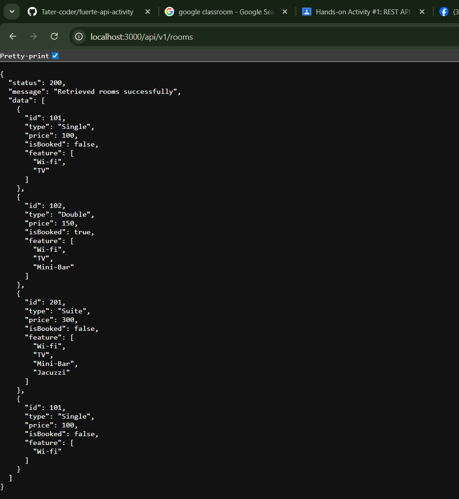

1. Markdown
2. # RESTful API Activity - Yuan Wilson Fuerte
3. ## Best Practices Implementation
4. **1. Environment Variables:**
5. - Why did we put `BASE_URI` in `.env` instead of hardcoding it?
6. - Answer: We placed BASE_URI in the .env file to keep configuration values separate from the source code. This makes the application more secure, easier to maintain, and flexible across different environments (development, testing, production). If the base URL changes, we can update it in one place without modifying the code itself, and sensitive information is not exposed in the public repository.
7. **2. Resource Modeling:**
8. - Why did we use plural nouns (e.g., `/dishes`) for our routes?
9. - Answer: Plural nouns are used to represent collections of resources. Using /dishes clearly indicates that the endpoint handles multiple dish records, while individual items can be accessed using an ID (e.g., /dishes/1). This follows RESTful conventions and keeps the API consistent, predictable, and easy to understand.
10. **3. Status Codes:**
11. - When do we use `201 Created` vs `200 OK`?
12. Answer: 201 Created is used when a new resource is successfully created, such as after a POST request.  
200 OK is used when a request is successful but does not create a new resource, such as retrieving or updating existing data.
13. - Why is it important to return `404` instead of just an empty array or a generic error?
Returning 404 Not Found clearly tells the client that the requested resource does not exist. This improves error handling, avoids confusion, and helps developers quickly identify issues. Using proper status codes makes the API more reliable, standardized, and easier to debug.
14. - Answer: 
15.
16. **4. Testing:**
17. - (Paste a screenshot of a successful GET request here)

1. Authentication vs Authorization:

 Question: What is the difference between Authentication and Authorization in our 
code?

Answer: The process of confirming a user's identification is known as authentication, and it typically involves determining whether the password and email address they entered match the information in the database when they log in. Conversely, authorization establishes what the authenticated user is permitted to do within the system. Authorization verifies a user's permissions after they log in before granting them access to resources or routes that are protected.

2. Security (bcrypt):
Question: Why did we use bcryptjs instead of saving passwords as plain text in 
MongoDB?

Answer: We implemented bcryptjs to hash passwords prior to saving them in MongoDB to enhance security. Storing passwords in plain text would allow anyone with access to the database to easily view all user passwords. By utilizing bcryptjs for password hashing, the original password cannot be directly accessed, which aids in safeguarding user accounts even if the database is breached.

3. JWT Structure:
 Question: What does the protect middleware do when it receives a JWT from the 
client?

Answer: The protect middleware verifies the JWT sent by the client to ensure it is valid and not tampered with. It decodes the token, retrieves the user ID from it, and then checks the database to confirm that the user exists.
If the token is valid, the middleware allows access to the protected route. If the token is missing or invalid, it denies access and returns an unauthorized error.